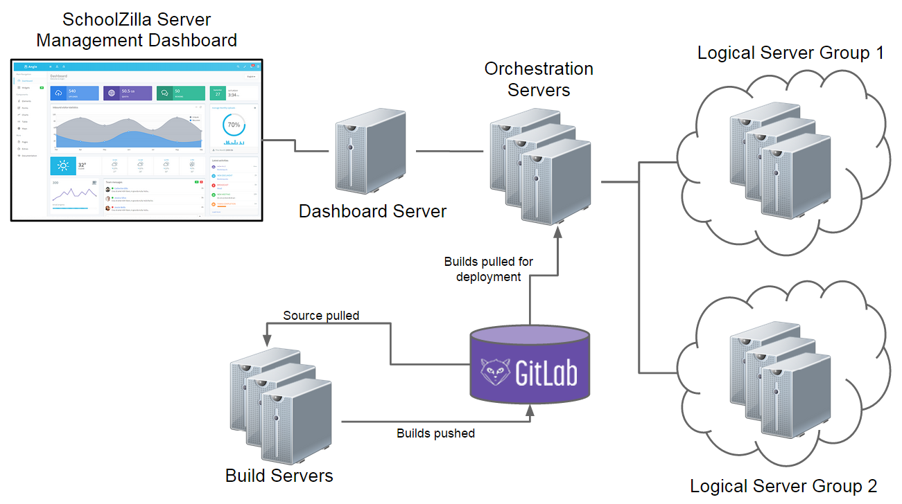

Solution for Part 3 
===================

In addition to the health status checking delivered in the solution for [part 1](PART1.md) and [part 2](PART2.md), the following features are desired functionality with the SchoolZilla "server management system":

 - Local health checks
 - Service Orchestration
 - System Task Management
 - Automated Release Deployment

Proposal
--------

There are three major areas of concern:

 - Server management dashboard
 - Service orchestrator
 - Locally installed agents

Server Management Dashboard
---------------------------

The server management dashboard will allow users to view information about individual servers, launch tasks against servers or groups of servers, and push builds to servers or groups of servers.  Additionally the server management dashboard should give the ability to remotely control the end point system through a SSH or RDP session.  Ideally, connections would be made to remote systems through shared keys or by using passwords stored in a password vault. 

Service Orchestrator
--------------------  

A service orchestrator can run tasks on end point machines or can request or control end point machines via exposed interfaces (like the one provided in the solution for [part 1](PART1.md)).

There should be a central repository of deployment information, ideally stored in a source control system like [GitLab](https://about.gitlab.com/). Tasks and builds should either be checked in manually into the source control system or be automatically checked in through a continuous integration system like [Jenkins](http://jenkins-ci.org/).  The service orchestrator should pull builds and tasks from the source repo to push to endpoints so that changes can be tracked and rolled back to previous versions if necessary.

The solution to [part 1](PART1.md) could be extended to allow receiving of builds via ssh or file uploads and could could then have control mechanisms built in to deploy content or execute code.

While a service orchestrator can be built from scratch, choosing a pre-built option like [Ansible](http://www.ansible.com/home), [Chef](https://www.getchef.com/chef/), [Puppet ](http://puppetlabs.com/) or [SaltStack](http://www.saltstack.com/community/) will probably be a better choice. 

For a great comparison of service orchestrators [see this article](http://www.infoworld.com/article/2609482/data-center/review--puppet-vs--chef-vs--ansible-vs--salt.html).

Without knowing all the requirements for a service orchestration system, I would hesitate to recommend a specific one.  I have a personal preference to [SaltStack](http://www.saltstack.com/community/) based on it's robust architecture, small client and server-push control paradigm.

Locally installed agents
------------------------
Each server will require a locally installed agent. The agent can be something as simple as the solution to [part 1](PART1.md) with some added features like the ability to launch uploaded tasks. However, if an "off the shelf" service orchestrator is chosen, the orchestrator will have an agent which should be deployed to communicate with the orchestrator.

The overall server management diagram for SchoolZilla might look like the following:

